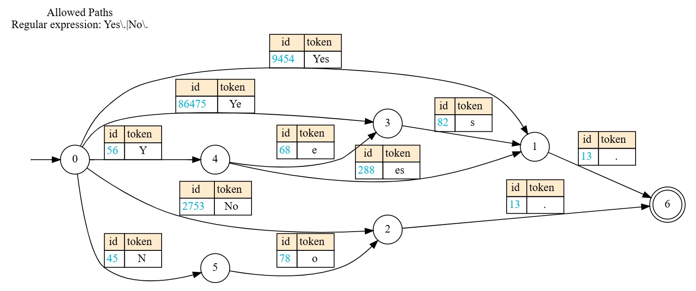
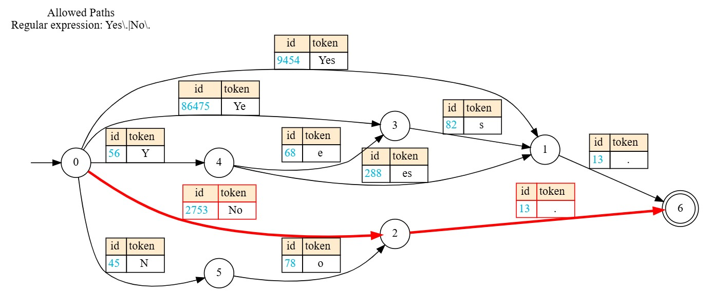

[](https://badge.fury.io/py/litelines)
[](https://opensource.org/licenses/Apache2.0)

# litelines

## Installation

```bash
pip install litelines
```

## Supported Frameworks
* transformers
*

## Basic Usage

- Define a logits processor through a Pydantic schema or a regular expression and visualize it:
```python
from litelines.transformers import JSONProcessor

processor = JSONProcessor(r"Yes\.|No\.", tokenizer)
processor.show_graph()
```


- Generate a structured answer:
```python
from transformers import AutoModelForCausalLM, AutoTokenizer

tokenizer = AutoTokenizer.from_pretrained(model_name)
model = AutoModelForCausalLM.from_pretrained(model_name).to("cuda:0")

messages = [{"role": "user", "content": "Are you sentient?"}]
inputs = tokenizer.apply_chat_template(
    messages, add_generation_prompt=True, return_tensors="pt", return_dict=True
).to(model.device)
generated = model.generate(**inputs, logits_processor=[processor])
print(tokenizer.decode(generated[0][inputs['input_ids'].shape[-1]:]))
# No.
```

- Visualize the selected path:
```python
processor.show_graph()
```

